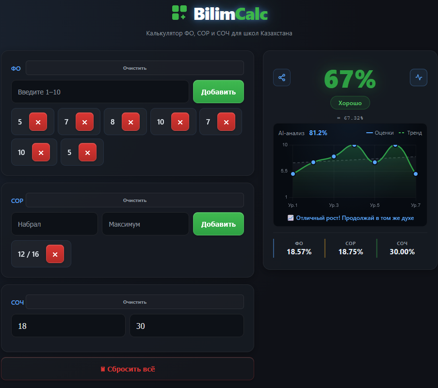

# 👋 Hi, I'm Anton

  

---

## 👨‍💻 About

- 🇰🇿 Developer from Kazakhstan  
- 🧠 Learning Machine Learning  
- ⚡ Building real-world tools  
- 📈 Constantly improving  

---

## 🛠 Tech Stack

  

---

## 🚀 Projects

### 🔹 BilimCalc

🔗 https://bilimcalc.vercel.app/

> Calculator for school grading (FO, SOR, SOCH)

- ⚡ Fast & simple 
- 🎯 Helps students predict final grades  
- 📱 Works on any device  
- 🆓 Free & no registration  

  

---

### ⚡ More coming soon...

> Currently building new projects 👨‍💻

---

## 🌐 Links

  

---

## 🐍 Activity

  

